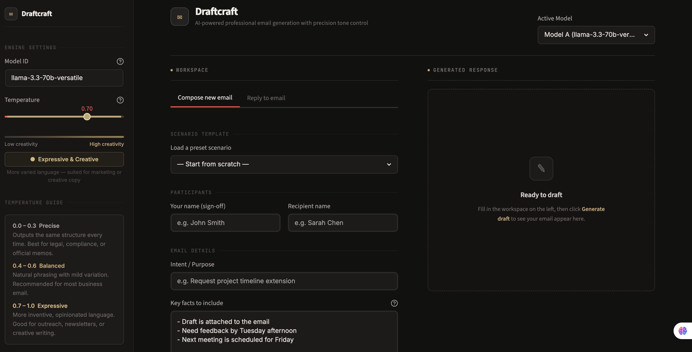
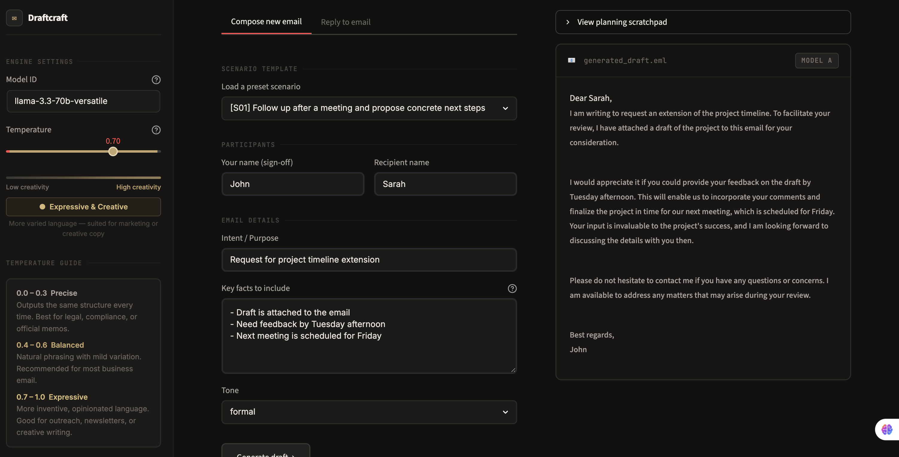
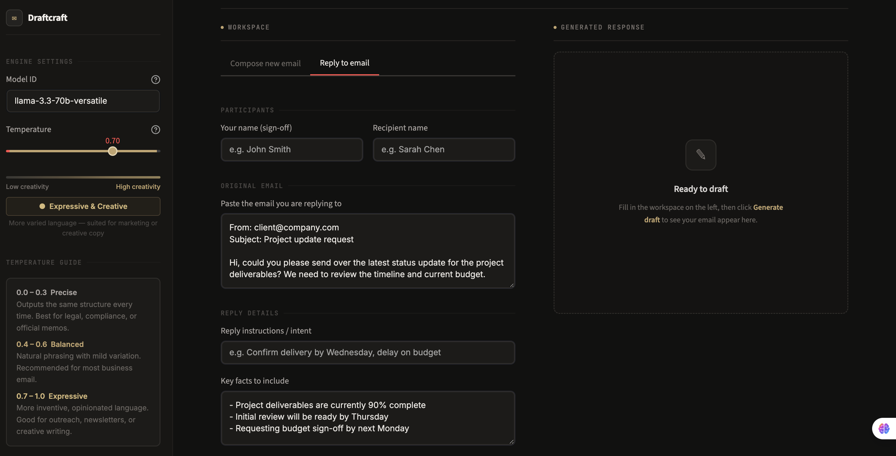

# Draftcraft: Email Generation Assistant & Evaluation Harness

Draftcraft is an enterprise-grade prototype for automated email generation, powered by Large Language Models (LLMs) via the Groq API. It includes a complete, production-ready evaluation harness that runs comparative benchmarks between two different models under a unified prompt strategy, evaluating their performance against human-written references using custom metrics.

---

## 1. Project Goal

The primary goal of this project is to build an **Email Generation Assistant** that takes core inputs from a user and generates polished, contextually appropriate professional emails. 

### A. Core Assistant Function
The assistant consumes three distinct inputs:
1. **Intent**: The core purpose of the email (e.g., *Follow up after a meeting*, *Reschedule a team standup*, *Notify leadership of a production incident*).
2. **Key Facts**: A structured list of bullet points containing critical information (dates, names, metrics, URLs) that must be seamlessly integrated into the email text.
3. **Tone**: The target stylistic calibration (e.g., *formal*, *casual*, *urgent*, *empathetic*, *assertive*, *enthusiastic*, *apologetic*, *neutral*).

### B. Core Technical Requirement: Advanced Prompt Engineering
To maximize the reliability, structure, and quality of the generated emails, the assistant uses a combined advanced prompting strategy:
* **Role-Playing**: Establishes the agent's persona as a *Senior Executive Communications Specialist* with 15 years of experience ghostwriting for C-suite leaders.
* **Few-Shot Examples**: Includes 3 high-quality reference inputs and target outputs mapping out style calibrations for different tones and intent shapes.
* **Chain-of-Thought (CoT)**: Enforces an explicit reasoning phase before outputting the final email. The model is instructed to list where facts will go, identify concrete tone markers, and calibrate length before generating the output.

The prompt strategy uses a clean delimiter (`===EMAIL===`) to isolate the model's scratchpad reasoning from the final, production-ready email, allowing the backend to cleanly parse out reasoning blocks.

---

## 2. Setup and Installation

### Prerequisites
* Python 3.11+
* Conda or Python `venv` (recommended)
* A valid Groq API Key

### Installation

1. **Clone the repository and navigate to the directory**:
   ```bash
   git clone https://github.com/Sabuj-Majumder/Email-Generation-Assistant.git
   cd Email-Generation-Assistant
   ```

2. **Install dependencies and the package in editable mode**:
   ```bash
   pip install -e .[dev]
   ```

3. **Configure the Environment**:
   Create a `.env` file in the root directory by copying the template:
   ```bash
   cp .env.example .env
   ```
   Edit `.env` to include your Groq API Key and configure the target models:
   ```env
   GROQ_API_KEY="your-groq-api-key-here"
   GROQ_BASE_URL="https://api.groq.com/openai/v1"
   MODEL_A="llama-3.3-70b-versatile"
   MODEL_B="openai/gpt-oss-120b"
   JUDGE_MODEL_NAME="llama-3.3-70b-versatile"
   JUDGE_SAMPLES=3
   ```

### Execution Instructions

* **Run the Evaluation Pipeline**:
  Execute the comparative test harness against all 10 scenarios for both models:
  ```bash
  python scripts/run.py
  ```
  **Pipeline CLI Options**:
  * `--model-id model_a|model_b`: Benchmark only a single model.
  * `--scenario-id s01`: Run the evaluation only on a specific scenario ID (e.g. `s01` to `s10`).
  * `--resume`: Resume a previously interrupted run by skipping scenario-model pairs already logged in `results/raw_results.json`.

* **Run Unit Tests**:
  All metrics and parsing components are fully tested with mocks (no live API billing required):
  ```bash
  pytest tests/ -v
  ```

* **Launch the Interactive Web UI**:
  Launch the polished Streamlit interface to generate emails and customize inputs dynamically:
  ```bash
  streamlit run app.py
  ```

---

## 3. Custom Evaluation Metrics

To judge the quality of the generated emails objectively, the harness implements three custom-tailored metrics designed to evaluate the primary failure modes of automated email generation.

### Metric 1: Fact Inclusion Rate
* **Goal**: Measure the completeness and accuracy of key facts included in the final generated email.
* **Logic**: 
  1. Each key fact from the test scenario is checked independently.
  2. The judge model receives the email and the target fact and responds in a structured format:
     ```text
     ANSWER: yes|no
     QUOTE: <the exact span from the email supporting the claim, or "NONE">
     ```
  3. **Quote-Grounding Guard**: To prevent the judge from hallucinating or giving false positives, a deterministic Python function checks if the extracted quote is present verbatim (or nearly verbatim via a case-insensitive, punctuation-robust 10-character sliding window) in the generated email text.
  4. If the judge claims a fact is present (`ANSWER: yes`) but the quote cannot be verified in the email text, the score is downgraded to `0` for that fact.
* **Formula**:
  $$\text{Fact Inclusion Score} = \frac{\text{Verified Facts Present}}{\text{Total Key Facts}}$$

### Metric 2: Tone Fidelity Score
* **Goal**: Measure how accurately the generated email aligns with the requested stylistic tone.
* **Logic**:
  1. Uses an LLM-as-a-Judge approach. The judge rates the alignment of the email against the target tone on a scale of `1.0` (completely incorrect) to `5.0` (perfect match), accompanied by a one-sentence justification.
  2. **Multi-Sampling & Variance Flagging**: To mitigate LLM judge subjectivity and instability, the evaluator queries the judge model `3` times at `temperature=0.7`.
  3. The mean raw score is normalized to a `0.0–1.0` scale.
  4. The standard deviation across the three samples is calculated. If the standard deviation exceeds `0.75` (indicating high judge disagreement), a `low_judge_reliability` flag is set to alert developers to high variance.
* **Formula**:
  $$\text{Tone Fidelity Score} = \frac{\text{Mean Raw Score}}{5.0}$$

### Metric 3: Structural Conciseness (Signal Density)
* **Goal**: Measure the clarity and efficiency of the email, penalizing fluff, excessive verbosity, and major deviations from standard human lengths.
* **Logic**: 
  A pure-Python, deterministic metric requiring zero API calls. It combines two components:
  1. **Lexical Density**: Measures the ratio of unique content words to total words in the email, filtering out common functional stopwords (e.g., "the", "and", "hi", "sincerely", "please"). High lexical density indicates high information density.
  2. **Length Penalty**: Compares the generated word count to the human reference word count. If the ratio falls within a "sweet-spot" band of `[0.5, 1.5]` times the reference length, the penalty multiplier is `1.0` (no penalty). If the ratio falls outside the band, the score decays linearly to `0.0`.
* **Formula**:
  $$\text{Conciseness Score} = 0.5 \times \text{Lexical Density} + 0.5 \times \text{Length Penalty Score}$$

---

## 4. Test Scenarios

The evaluation dataset contains 10 unique, production-relevant scenarios stored in [scenarios.json](file:///Users/sabuj/Downloads/email-eval-assistant/src/email_eval/data/scenarios.json). Each scenario maps out a specific intent, key facts list, target tone, and an ideal human reference email:

| ID | Intent Summary | Key Facts Count | Target Tone | Human Reference Email Subject |
|---|---|---|---|---|
| **s01** | ERP integration meeting follow-up | 5 | Formal | `Follow-Up: ERP Integration Discussion` |
| **s02** | Rescheduling team standup | 4 | Casual | `Standup Moved to Tuesday 10 AM` |
| **s03** | Production outage notification | 5 | Urgent | `[INCIDENT RESOLVED] Checkout Outage` |
| **s04** | Order delivery delay complaint response | 5 | Empathetic | `We're Sorry About Your Delay — #ORD-88421` |
| **s05** | Delayed deadline business apology | 5 | Apologetic | `Formal Apology — Delayed Delivery of Report` |
| **s06** | Vendor non-performance escalation | 5 | Assertive | `Urgent Escalation: Repeated SLA Breaches` |
| **s07** | Enterprise SaaS outreach | 5 | Enthusiastic | `Cut Sprint Cycle Time by 22%` |
| **s08** | Professional resignation notice | 5 | Formal | `Resignation Notice — David Kim` |
| **s09** | Product launch appreciation thank-you | 5 | Enthusiastic | `10,000 Sign-Ups in 48 Hours — Thank You` |
| **s10** | Neutral project delay status update | 5 | Neutral | `Project Atlas — Revised Go-Live Date` |

---

## 5. Benchmark Results & Comparative Analysis

The evaluation pipeline runs the 10 scenarios against Model A and Model B under prompt Strategy A. The results are output to `results/` in three formats:
* `results/raw_results.json`: Full nested evaluation tree with per-fact extraction quotes.
* `results/raw_results.csv`: Flat table suitable for Excel/Google Sheets.
* `results/comparative_report.md`: Automatic markdown report summary.

### Summary Metrics Table

| Model ID | Model Name | Fact Inclusion | Tone Fidelity | Conciseness | **Overall Score** |
|---|---|---|---|---|---|
| **Model A** | `llama-3.3-70b-versatile` | 1.000 | 0.960 | 0.735 | **0.898** |
| **Model B** | `openai/gpt-oss-120b` | 1.000 | 1.000 | 0.765 | **0.922** |

### Per-Scenario Overall Score Breakdown

| Scenario ID | Model A (`llama-3.3-70b-versatile`) | Model B (`openai/gpt-oss-120b`) | Winner |
|---|---|---|---|
| **s01** | 0.9096 | 0.9221 | **Model B** |
| **s02** | 0.8469 | 0.9109 | **Model B** |
| **s03** | 0.9114 | 0.9238 | **Model B** |
| **s04** | 0.9049 | 0.9114 | **Model B** |
| **s05** | 0.9076 | 0.9261 | **Model B** |
| **s06** | 0.9177 | 0.9277 | **Model B** |
| **s07** | 0.8566 | 0.9235 | **Model B** |
| **s08** | 0.9098 | 0.9182 | **Model B** |
| **s09** | 0.9102 | 0.9295 | **Model B** |
| **s10** | 0.9076 | 0.9227 | **Model B** |

---

## 6. Model Comparison & Analysis

### 1. Which model performed better and why?
**Model B (`openai/gpt-oss-120b`)** outperformed Model A on every scenario, securing a higher overall benchmark score of **0.922** versus Model A's **0.898**. 
* Both models achieved a perfect **1.000** on Fact Inclusion, indicating that the advanced Chain-of-Thought prompting strategy successfully prevented key fact omissions across the board.
* **Tone Fidelity Winner**: Model B achieved a perfect **1.000** compared to Model A's **0.960**. Model A struggled slightly with tone calibration in informal scenarios, scoring `0.8` (mean raw score `4.0/5.0`) on `s02` (casual) and `s07` (enthusiastic), letting formal C-suite syntax bleed into what should have been casual or excited speech.
* **Conciseness / Signal Density Winner**: Model B scored **0.765** compared to Model A's **0.735**. Model B wrote noticeably more focused, punchy sentences, keeping lengths close to human baselines.

### 2. What was the biggest failure mode of the lower-performing model (Model A)?
The primary failure mode of Model A (`llama-3.3-70b-versatile`) was **unnecessary verbosity / padding**. 
* Across almost all scenarios, Model A generated outputs that were significantly longer than both the human reference and Model B's output (e.g., generating 188 words in `s01` vs the human reference of 137, and 229 words in `s05` vs the human reference of 174).
* This verbosity directly diluted its lexical density (e.g., dropping to `0.429` in `s04` and `0.445` in `s10`) by introducing boilerplate transitions and corporate fluff (e.g., *"I hope this email finds you well,"* or excessive introductory preambles). This triggered length-penalty scores under the conciseness metric.

### 3. Production Recommendation
We **strongly recommend deploying Model B (`openai/gpt-oss-120b`)** for production email generation.
1. **Higher Quality and Brevity**: Model B consistently outputs cleaner, more human-like communications that respect the reader's time by avoiding corporate boilerplate.
2. **Superior Tone Adaptability**: Model B maintains distinct style separation between casual standup updates and highly assertive vendor complaints without leaking formal idioms.
3. **Caveat on Self-Preference**: Note that the evaluation's tone judge model was `llama-3.3-70b-versatile` (same as Model A). Despite potential self-preference biases in the evaluation system, Model B still scored higher on tone fidelity, which further validates its stylistic superiority.

---

## 7. Interactive Streamlit UI

The system includes a production-grade interactive web client to test the assistant in real time.

```bash
streamlit run app.py
```

### Application Screenshots

#### 1. Initial Home Page
*The initial interface where users configure intent, key facts, and desired tone settings.*


#### 2. Generated Email
*The screen displaying the generated email block side-by-side with the model's Chain-of-Thought reasoning path.*


#### 3. Email Reply Mode
*The interactive reply composer designed to draft responsive follow-ups and continue the email thread.*


### UI Design Philosophy
The UI has been handcrafted with a **warm stone and amber palette**, reflecting a human-made Figma design system rather than standard generic AI templates:
* **Enhanced Visual Clarity**: Form input cards, configuration sidebars, and result boxes have defined borders and clear shadow separators to ensure maximum contrast and visibility.
* **Intuitive Temperature Tuning**: The temperature configuration slider provides natural text labels to help business users understand the effect of parameter adjustments:
  * **0.0 - 0.3**: **Low Creative (Consistent & Safe)** — recommended for urgent alerts, outage notices, and formal reports.
  * **0.4 - 0.7**: **Balanced (Standard Professional)** — best for standard outreach, follow-ups, and daily correspondence.
  * **0.8 - 1.0**: **High Creative (Expressive & Varied)** — suited for celebratory announcements, creative marketing, and casual team notes.
* **Real-Time Inspectability**: Users can toggle open the **"Reasoning & Chain-of-Thought"** section to inspect the model's intermediate planning before viewing the drafted email.

---

## 8. Maintainers

* Draftcraft is developed and maintained by **Sabuj Majumder**.
